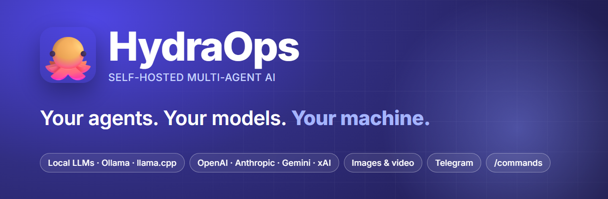

<p align="center">
  <a href="https://hydraops.org"></a>
</p>

<p align="center">
  <a href="https://github.com/TraX22/HydraOps/releases/latest"></a>
  <a href="https://github.com/TraX22/HydraOps/releases"></a>
  <a href="LICENSE"></a>
  <a href="https://hydraops.org"></a>
</p>

[English](README.md) | **Español**

🌐 **[hydraops.org](https://hydraops.org)** · [Descarga la última versión](https://github.com/TraX22/HydraOps/releases/latest) · [X @HydraOpsApp](https://x.com/HydraOpsApp)

**IA multi-agente autoalojada, en tu propia máquina.** Una aplicación de escritorio
(instalador para Windows) o un servidor sin pantalla, con un chat donde varios agentes de
IA — cada uno con su personalidad, su modelo, sus herramientas y su memoria — resuelven
tareas en paralelo: investigación, código, imágenes y vídeo. Con tus claves de API o con
modelos locales; hablás con tus agentes desde la aplicación, desde Telegram o con
`/comandos`.

Funciona con modelos de API (OpenAI, Anthropic, Gemini, Groq, xAI, Mistral, DeepSeek,
Qwen, Kimi, GLM, MiniMax, OpenRouter, Perplexity, Leonardo) y con modelos locales por
cualquier servidor compatible con OpenAI — Ollama, llama.cpp, LM Studio, vLLM. Motores de
imagen y vídeo: Leonardo, Google Imagen y Veo, xAI Grok Imagine.

> **Estado:** en uso real sobre Windows (instalador de escritorio) y en **modo servidor**
> (headless) — accesible desde el navegador de otro equipo en tu red local con un token, o
> 24/7 con systemd (ver [Modo servidor](#modo-servidor-headless)). Falta la imagen de
> contenedor.

## Qué trae

- **Agentes con personalidad.** Cada uno son seis archivos Markdown editables desde la
  propia interfaz: alma, habilidades, herramientas, memoria, latido y ficha.
- **Agentes con memoria.** Una memoria permanente por agente (`remember`) y búsqueda de
  texto completo en sus conversaciones pasadas (`recall`) — archivos y SQLite, sin base
  de datos vectorial.
- **Agentes que delegan.** Un agente puede pasarle una tarea a otro (`delegate_task`), y
  todos tienen la instrucción de decirlo cuando les falta una herramienta en vez de
  fingir.
- **Cuatro tipos de worker** — código, general, imagen y vídeo — con su propio motor y
  aspecto configurables por agente. Vídeo con Google Veo, xAI Grok Imagine o Leonardo
  Motion; imágenes con Leonardo (Flux, Phoenix…), Google Imagen o Grok.
- **Herramientas.** Add-ons nativos (búsqueda web, Brave, Perplexity, `fetch_url` con
  respaldo RSS, transcripciones de YouTube, GitHub, Telegram), add-ons propios en
  `my_addons/` (se cargan en caliente) y servidores MCP por HTTP. Cada agente recibe solo
  las herramientas que le concedés.
- **Bot de Telegram.** Emparejás un chat con un código y hablás con cualquier agente
  desde el teléfono; las tareas programadas también pueden mandar sus resultados (y sus
  fallos) a Telegram.
- **Comandos.** Escribís `/` en el chat y aparece una paleta de verbos que no gastan
  tokens — `/agents`, `/use luna`, `/status`, `/delegate karen …`, `/remember`,
  `/recall` — con alias en español; los mismos comandos funcionan en Telegram.
  Ver [Comandos](docs/es/15-commands.md).
- **One Shot.** Dibujás una tarea como un diagrama de flujo de nodos y conexiones y tu
  modelo lo compila en un único prompt completo.
- **Cortafuegos de credenciales.** Las claves de API nunca están en el repositorio, ni en
  la base de datos, ni en el `.env`: viven fuera del proyecto y un proxy local las inyecta
  en la frontera de red. Los workers solo ven el marcador `proxy`.
- **Guard de herramientas.** Toda herramienta pasa por un filtro que bloquea rutas de
  credenciales, comandos catastróficos y peticiones a redes internas, y redacta secretos
  de los resultados.
- **Chat con adjuntos**, imágenes y vídeo en línea, diagramas Mermaid, LLM y costo en
  tokens de cada mensaje, tareas programadas con selector de horario, estadísticas e
  interfaz en cinco idiomas (es, en, it, fr, pt-BR).

## Arquitectura

Monorepo pnpm en TypeScript ESM. El flujo de una tarea:

```
UI (Angular) → API (Express) → outbox en SQLite → outbox-worker → NATS JetStream
                                                                        ↓
                       resultado ← worker-{coder,general,graphic,video} ← orchestrator
```

Ninguna aplicación publica directamente en NATS: todas escriben en la tabla `outbox` y un
único proceso la vacía, de modo que un fallo de red no pierde eventos. Los consumidores
usan `processed_events` para ser idempotentes.

| Ruta | Qué es |
|---|---|
| `apps/api/` | API REST y servidor de archivos |
| `apps/orchestrator/` | asigna cada tarea a un agente |
| `apps/outbox-worker/` | publica la outbox en NATS |
| `apps/worker-*/` | los cuatro ejecutores |
| `apps/key-proxy/` | cortafuegos de credenciales |
| `apps/telegram-bot/` | el transporte de Telegram |
| `apps/desktop/` | shell de Electron y empaquetado |
| `packages/` | config, db, llm, addons, commands, events, nats |
| `ui/` | interfaz de Angular |
| `agents/` | el agente de ejemplo; aquí aparecen también los que crees tú |

## Documentación

El manual de uso vive en [`docs/`](docs/README.md) (español e inglés) y también se lee dentro de la aplicación, en la vista **Docs**.

## Instalación

### Opción A — instalador de Windows

Descarga el `.exe` de la página de *Releases*. No necesita Node, ni pnpm, ni este
repositorio: los servicios corren sobre el Node que trae Electron.

Tus datos van a `%APPDATA%\HydraOps\data` y las claves a
`%APPDATA%\hydraops\keys.json`, fuera del directorio de instalación, así que actualizar
la aplicación no toca nada tuyo.

### Opción B — desde el código

Requisitos: **Node 20+**, **pnpm 9** y el binario de **nats-server**.

> **nats-server es imprescindible**: es el bus de mensajes entre la API y los agentes; sin
> él los *workers* no arrancan. Descárgalo de sus
> [releases](https://github.com/nats-io/nats-server/releases) según tu sistema:
> - **Debian/Ubuntu:** el paquete `.deb` de tu arquitectura (`…-amd64.deb` para PC de 64 bits,
>   `…-arm64.deb` para ARM) → **doble clic** para instalar, o `sudo dpkg -i nats-server-*-amd64.deb`
>   (o con apt, ojo al `./`: `sudo apt install ./nats-server-*-amd64.deb`; `apt install nats` a
>   secas no existe).
> - **Fedora/RHEL:** el `.rpm` equivalente → doble clic, o `sudo rpm -i nats-server-*-amd64.rpm`.
> - **macOS:** `brew install nats-server`. **Windows:** `choco install nats-server` (el instalador
>   `.exe` ya lo trae).
>
> También vale con tener el binario en el `PATH`, en una carpeta `nats/` del repositorio, o
> apuntado con `NATS_SERVER_BIN` en el `.env`. Comprueba con `nats-server --version`.

```bash
pnpm install
cp .env.example .env
```

Luego arráncalo con uno de los modos de abajo. Tanto `pnpm serve` como `pnpm desktop`
**compilan los paquetes y la interfaz por ti**, así que un clon recién hecho (o un `git pull`)
queda listo al momento — sin un paso de compilación aparte que recordar.

#### Modo servidor (headless)

Para tenerlo encendido 24/7 en una máquina sin pantalla — un mini PC en casa, por
ejemplo. Un solo comando levanta NATS y todos los servicios, sin Electron:

```bash
pnpm serve
```

Aplica las migraciones y siembra la base de datos él solo (el primer arranque desde un
clon limpio funciona sin pasos previos), espera la salud de cada fase, reinicia lo que se
caiga y con Ctrl+C (o el `SIGTERM` de systemd) para la pila entera. Los logs salen por
consola con prefijo por servicio y quedan también en `storage/logs/`.

Para abrirlo a tu red local, define en el `.env` `HYDRA_HOST=0.0.0.0` y un
`HYDRA_AUTH_TOKEN` (ver [Seguridad](#seguridad)); la propia salida de `pnpm serve` te
dirá las URLs. Sin token, la API se queda en loopback.

Para que arranque solo al encender la máquina hay una unidad de systemd lista en
[`deploy/hydraops.service`](deploy/hydraops.service), con las instrucciones de
instalación dentro; los logs de todos los servicios acaban en el journal
(`journalctl -u hydraops -f`).

#### Modo escritorio

La ventana de Electron, con splash y supervisor integrados:

```bash
pnpm desktop        # compila paquetes + interfaz y abre la aplicación
pnpm desktop:quick  # sin recompilar (relanzado más rápido)
```

#### Modo desarrollo

Con recarga en caliente:

```bash
pnpm dev                    # los servicios en modo watch
pnpm --filter ui start      # la interfaz, aparte, en el 4200
```

### Empaquetar el instalador

```bash
pnpm build           # los paquetes primero: el resto consume su dist/, no el fuente
pnpm desktop:dist    # interfaz + backend autocontenido + instalador NSIS
```

El resultado queda en `apps/desktop/release/`. Cierra la aplicación antes: el instalador
no puede sobrescribir archivos en uso.

### Publicar una versión

Empujar un tag `v*` dispara [`.github/workflows/release.yml`](.github/workflows/release.yml):
un runner de Windows compila el instalador y lo sube —con el `latest.yml` del que depende
la autoactualización— a una Release de GitHub. Para sacar una:

```bash
# sube la versión en apps/desktop/package.json (p. ej. 0.1.1), y luego:
git commit -am "Versión 0.1.1"
git tag v0.1.1
git push origin main --tags
```

El tag debe coincidir con la versión de `apps/desktop/package.json`. Las apps de escritorio
instaladas consultan esa Release al arrancar, descargan la versión nueva en segundo plano y
ofrecen reiniciar. El instalador aún no está firmado, así que la **primera** instalación
muestra el aviso de SmartScreen (la autoactualización se verifica por hash, no por firma).
El modo servidor (headless) no usa esto — se actualiza con `git pull` (ver
[Modo servidor](#modo-servidor-headless)).

## Configuración

Las claves de API se ponen **desde la vista Configuración de la aplicación**, no en
archivos. El `.env` solo guarda infraestructura y el modelo local; mira `.env.example`,
que explica cada variable.

Los tres ajustes del modelo local (`LOCAL_LLM_URL`, `LOCAL_LLM_KEY`, `LOCAL_LLM_MODEL`)
viven únicamente en el `.env` a propósito, y los workers lo releen en cada tarea: puedes
cambiar de servidor local sin reiniciar nada.

## Seguridad

Cuatro cosas que ya están resueltas:

- **Las claves de API nunca salen del cortafuegos.** Viven fuera del proyecto y las inyecta
  el key-proxy en la frontera de red: ni los workers, ni la base de datos, ni el `.env`
  llegan a ver una clave real.
- **Todas las herramientas pasan por un guard** que bloquea rutas de credenciales y
  comandos destructivos, redacta secretos de los resultados e impide que `fetch_url`
  alcance direcciones internas.
- **La API escucha solo en `127.0.0.1`.** De fábrica no es alcanzable desde otra máquina.
- **Abrirla a la red exige un token.** Con `HYDRA_HOST=0.0.0.0` la API pide
  `HYDRA_AUTH_TOKEN`: el navegador lo pregunta una vez (pantalla de login) y sin token
  definido la API directamente se niega a abrirse. Las conexiones desde la propia máquina
  no lo necesitan.

Un límite que conviene conocer: el token viaja **en claro por HTTP**, así que sirve para tu
red local, no para exponer el puerto a internet. Si algún día quieres accederlo desde fuera
de casa, ponlo detrás de HTTPS (un proxy inverso con certificado o una VPN tipo WireGuard
o Tailscale) — y con proxy inverso delante, activa `HYDRA_AUTH_STRICT=1` para que el token
se exija también a esas conexiones.

Para reportar un fallo, mira [SECURITY_es.md](SECURITY_es.md) o escribe a
**security@hydraops.org**.

## Privacidad

HydraOps corre por completo en tu máquina y no recopila ningún dato propio — mira
la [Política de Privacidad](PRIVACY_es.md).

## Contacto

Preguntas, ideas, lo que sea: **hi@hydraops.org** — o abre un issue.

Síguenos en X: [@HydraOpsApp](https://x.com/HydraOpsApp).

## Licencia

Apache 2.0 — ver [LICENSE](LICENSE) y [NOTICE](NOTICE).
