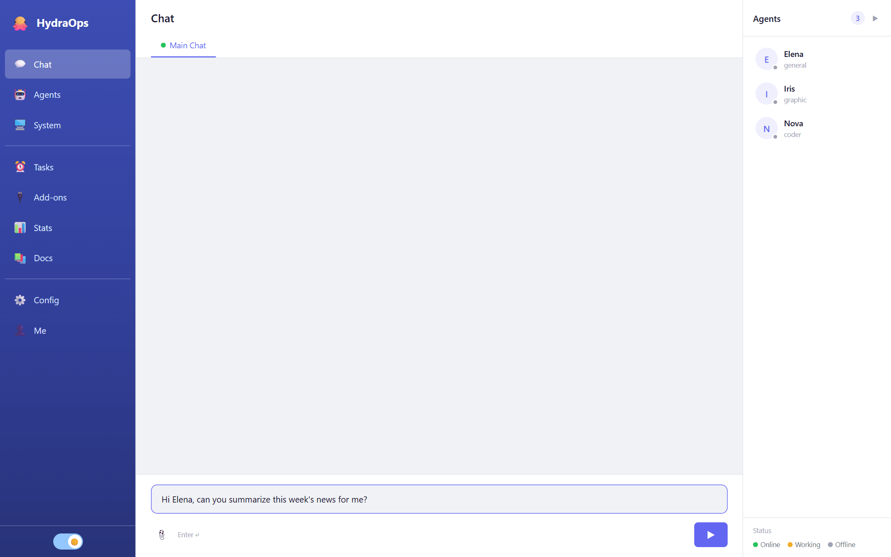

# First steps

The first time you open HydraOps, two things before anything else: a model to work with and at least one agent. Without agents, messages stay unassigned.

## 1. Set up a model

Go to **Settings** (gear icon in the sidebar) and paste your provider's API key — one is enough to get started. If you prefer a local model (llama.cpp, LM Studio, Ollama…), it is configured in the `.env`. Details in [API keys & models](./04-api-keys.md).

## 2. Create your first agent

In the **Agents** view, click **New agent**: name, worker type (to start, **general**) and model. It is created with six template personality files you can edit whenever you want. More in [Agents](./05-agents.md).

## 3. Talk to it

Go to **Chat** and type. The task is assigned to the agent and the reply shows up in the channel. You can attach images and documents with the 📎 clip. More in [Chat](./06-chat.md).

## A tour of the sidebar

- **Chat** — the main channel where you talk to agents and results arrive.
- **Agents** — create, configure and edit agents; their avatar, model and files.
- **System** — worker status and logs.
- **Tasks** — scheduled tasks (crons).
- **Add-ons** — the tools: native add-ons, your own and MCP servers.
- **Statistics** — completed and failed tasks, tokens, timings, per-agent usage.
- **Docs** — this manual.
- **Settings** — API keys, default model, local LLM, log level.
- **Profile** — who you are: agents use that information to personalize their replies.

The moon/sun button switches between day and night themes, and the interface language is picked in **Settings → Languages** (the manual exists in Spanish and English; with the interface in another language, it shows in English).

## The right panel

The agent list is always at hand in the right panel. Each one shows its status; the 💬 button opens the chat with it, and double-clicking its avatar inside the chat jumps to its profile.
