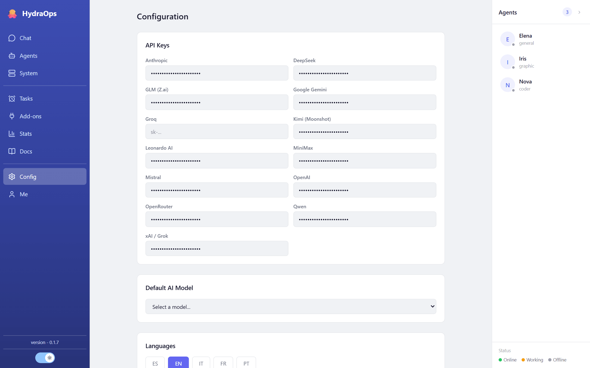

# API keys & models

## Adding an API key

In **Settings → API Keys** there is one field per provider: OpenAI, Anthropic, Gemini, Groq, xAI, Mistral, DeepSeek, Qwen, Kimi, GLM, MiniMax, OpenRouter and Leonardo. Paste the key and save. You don't need to fill them all: with one provider, every agent using its models already works.



Keys are **not stored in the project, nor in the database, nor in any `.env`**: they go to a store of their own outside the application (`%APPDATA%\hydraops\keys.json` on Windows) and a local process — the key-proxy — injects them only at the moment of calling the provider. That is why the Settings view shows them masked: that's expected. More in [Security](./11-security.md).

## Logging in with OpenRouter

With OpenRouter you don't need to copy a key by hand: click **Log in with OpenRouter** under its field, authorize in your browser, and OpenRouter hands HydraOps a key of its own, stored in the same secure store as the rest. Models that arrive this way are labeled `Log ·` in the model selector (instead of `APIkey ·`). If you ever paste a key manually into the field, that one takes over and the label goes back to `APIkey ·`.

## Choosing a model

- **Default model:** in Settings; used when an agent has none of its own.
- **Per-agent model:** in the agent's profile (Agents view). Each agent can use a different provider.

Models from providers with no key appear as "unavailable" until you add theirs.

## Local model

If you have a local OpenAI-compatible server (llama.cpp, LM Studio, vLLM, Ollama…), it is configured with three variables in the project's `.env` file (or the server's, in headless mode):

```bash
LOCAL_LLM_URL=http://127.0.0.1:8080/v1   # your server's URL
LOCAL_LLM_KEY=                           # if your server wants a key; empty otherwise
LOCAL_LLM_MODEL=my-model                 # the name your server announces
```

They live in the `.env` on purpose and the workers re-read it **on every task**: you can switch local servers or models without restarting anything. In the model list, the local one carries the "Local:" label.

If your local server supports vision (a multimodal model with its projector), agents will also be able to see the images you attach in the chat.

## Which provider should I use?

Whichever you already have. As a reference: Gemini and Groq have generous free tiers to get started; OpenRouter gives access to many models with a single key; Leonardo is specific to image generation; and a local model costs nothing per task, in exchange for your hardware.
