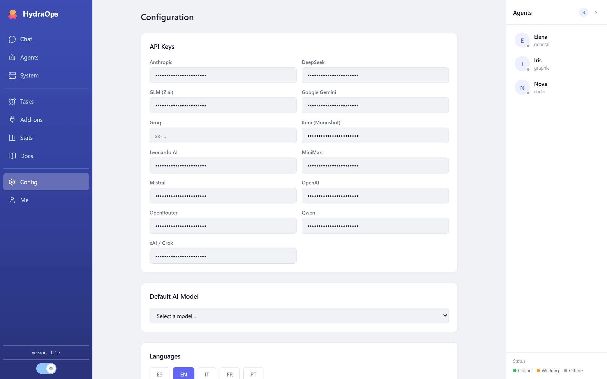

# API keys & models

## Adding an API key

In **Settings → API Keys** there is one field per provider: OpenAI, Anthropic, Gemini, Groq, xAI, Mistral, DeepSeek, Qwen, Kimi, GLM, MiniMax, OpenRouter and Leonardo. Paste the key and save. You don't need to fill them all: with one provider, every agent using its models already works.



Keys are **not stored in the project, nor in the database, nor in any `.env`**: they go to a store of their own outside the application (`%APPDATA%\hydraops\keys.json` on Windows) and a local process — the key-proxy — injects them only at the moment of calling the provider. That is why the Settings view shows them masked: that's expected. More in [Security](./13-security.md).

## Using your ChatGPT subscription

If you have ChatGPT Plus or Pro, you can use that plan instead of an OpenAI API key. OpenAI offers open-source applications a sign-in ("Sign in with ChatGPT", in preview) through which the user authorizes model requests to be charged to their plan, under a weekly per-app cap they set themselves.

In **Settings → ChatGPT (subscription)** click **Connect with ChatGPT**: the browser on that same computer opens, you sign in to OpenAI and accept the permission. Back in HydraOps the section shows the account (email masked) and the models your plan serves; the model selector groups them as **ChatGPT (plan)**, apart from **APIkey · OpenAI** if you also have a key. Each agent picks one or the other.

Worth knowing:

- HydraOps never sees your password or your ChatGPT conversations: it only gets a permission to query models. The access tokens stay on the computer, next to the keys (`%APPDATA%\hydraops\chatgpt.json`), handled by the key-proxy; they never reach the database or the chat.
- The permission renews itself as long as HydraOps is used at least once a month. If it expires, the section says so and connecting again is enough.
- You set the weekly cap in ChatGPT → Settings → Usage. There are no per-token charges; when the cap is reached the agent's task fails with a clear notice, and you can raise the cap or switch the agent's model with `/model`.
- It works for chat, agents with their tools, scheduled tasks and Telegram. It does not generate images, video or audio: those still need the provider's key.
- In server mode the sign-in link has to be opened in a browser **on the same machine** (through remote desktop, for example); the section shows it to copy and it is also printed on the console. It does not work from a phone, because the return address is local to that machine.
- Only OpenAI allows this. Anthropic and Google forbid using their subscriptions from third-party applications, so Claude and Gemini keep going through keys.

To disconnect, **Disconnect** in the same section: the permission is revoked at OpenAI and the tokens are deleted. You can also remove the application from ChatGPT's settings.

## Choosing a model

- **Default model:** in Settings; used when an agent has none of its own.
- **Per-agent model:** in the agent's profile (Agents view). Each agent can use a different provider.

Models from providers with no key appear as "unavailable" until you add theirs.

## Local model

If you have a local OpenAI-compatible server (llama.cpp, LM Studio, vLLM, Ollama…), it is configured with three variables in the project's `.env` file (or the server's, in headless mode):

```bash
LOCAL_LLM_URL=http://127.0.0.1:8080/v1   # your server's URL
LOCAL_LLM_KEY=                           # if your server wants a key; empty otherwise
LOCAL_LLM_MODEL=my-model                 # the name your server announces
```

They live in the `.env` on purpose and the workers re-read it **on every task**: you can switch local servers or models without restarting anything. In the model list, the local one carries the "Local:" label.

If your local server supports vision (a multimodal model with its projector), agents will also be able to see the images you attach in the chat.

## Which provider should I use?

Whichever you already have. As a reference: Gemini and Groq have generous free tiers to get started; OpenRouter gives access to many models with a single key; Leonardo is specific to image generation; and a local model costs nothing per task, in exchange for your hardware.
