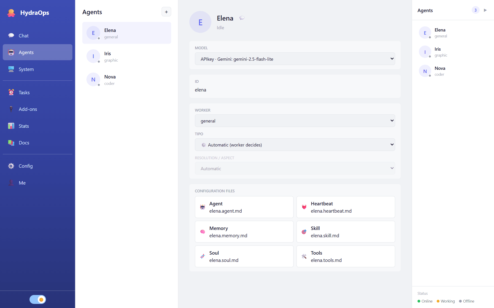

# Agents

An agent is who does the work: it has a name, an avatar, a personality, a worker type, a model and its tools. You can have as many as you want, each specialized in something.

## Creating an agent

In the **Agents** view, click **New agent** and choose:

- **Name** — its identifier comes from it (e.g. "Ana María" → `ana_maria`).
- **Worker type** — what kind of tasks it handles:
  - **general** — questions, research, writing; the all-rounder.
  - **coder** — coding tasks.
  - **graphic** — image generation.
  - **video** — video generation.
- **Model** — the LLM it will use; if you don't pick one, the default model from Settings.

A new agent is born with the basics already granted: `web_search`, `fetch_url`, `remember` and `recall`. Everything else stays off until you grant it from its `tools.md`.

## The agent's profile

Selecting an agent in the list opens its profile:

- **Avatar** — click to change it (PNG/JPG/WebP, 2 MB max).
- **Rename** — the pencil next to the name.
- **Model and engine** — the agent's LLM; for image and video workers, also the generation engine and the **resolution/aspect** (or "Automatic": the worker decides).
- **Configuration files** — the six Markdown files of its personality, editable in a modal.
- **💬** — opens the chat with it.

## The six files

Each agent is a folder `agents/<id>/` with six Markdown files. They are free-form text: write them the way you would talk to someone you're hiring.

| File | What goes inside |
|---|---|
| `<id>.soul.md` | Who it is: personality, tone, way of answering. |
| `<id>.skill.md` | What it knows how to do: its specialties and how to approach them. |
| `<id>.agent.md` | Its profile card: role, description, emoji. |
| `<id>.tools.md` | Which tools it may and may not use (see [Add-ons & MCP](./08-addons.md)). |
| `<id>.memory.md` | Persistent memory: what it should remember across conversations. You write it, and the agent itself extends it with `remember`. |
| `<id>.heartbeat.md` | Its heartbeat: instructions applied on every cycle. |

Changes apply to the next tasks, no restart needed.

**Per-agent tools (`<id>.tools.md`).** An agent can use a tool — native, add-on or MCP server — only if its `tools.md` **names** it. Editing the file in the Agents view opens a **tag selector**: every granted tool is a tag with its **×** to remove it, and the dropdown offers what's available grouped into **Add-ons, Tools and MCP**. A **red** tag warns that the name matches no current tool (and therefore grants nothing). If you prefer plain text, **Edit as text** shows the real file: one bullet per tool, with the exact name (`- web_search`) or a group prefix (`- github` enables every `github_*` tool; an MCP server name enables its tools). If it lists none, the agent has no tools. This holds for every worker type.

**Memory that writes itself.** With `remember` and `recall` (granted out of the box to new agents), the agent can **save** durable notes to its `memory.md` when you ask it to ("remember that…") and **search** its past conversations beyond the recent history ("what did I ask you last month about…?"). Each agent only writes and searches its own.

Beyond these files, **each worker type brings its trade out of the box**: the image one knows color theory and composition, the video one framing and cinematography, the code one architecture and patterns, and the general one how to deal with people. That knowledge ships with the application and every agent of the type inherits it — your six files define *who* your agent is and its concrete specialization; the worker brings the profession.

## Deleting an agent

From its profile. Its folder and configuration are removed; the messages it already sent stay in the chat history.
