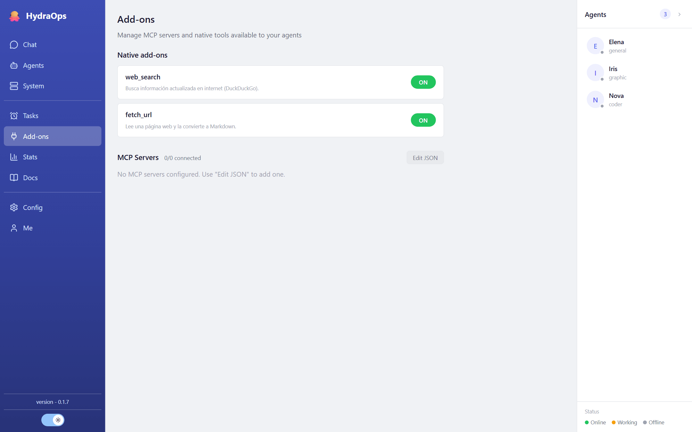

# Add-ons & MCP

Tools are what separate an agent that *answers* from one that *does*. HydraOps has three kinds, all managed from the **Add-ons** view.



## Native add-ons

They ship with the application: today they are `web_search` (searching the web) and `fetch_url` (downloading a page). Each card explains what its add-on does.

All of them go through a **security guard** that blocks credential paths, catastrophic commands and requests to internal networks, and redacts secrets from results. More in [Security](./13-security.md).

## Your add-ons (`my_addons/`)

You can write your own tools: each is a folder inside `my_addons/` (in the data folder) with a small module exporting the tool. They are **hot-loaded** — nothing to restart — and appear in the Add-ons view as "Custom".

Careful: your add-ons are your code and run unrestricted. Treat them as such.

## MCP servers

MCP (Model Context Protocol) is the standard for connecting third-party tools over HTTP. In **Add-ons → MCP servers**, the **Edit JSON** button opens the configuration:

```json
{
  "mcpServers": {
    "duckduckgo": {
      "url": "https://example.com/mcp",
      "headers": { "Authorization": "Bearer …" },
      "switch": "on"
    }
  }
}
```

Every server has its own switch, and the view shows its real status as reported by the workers: Connected, Connecting…, Connection error, Timed out, Off.

## Which tools each agent sees

By default, an agent sees the tools of its worker type. To fine-tune it, edit the agent's `tools.md` file (Agents view → Configuration files): there you declare which add-ons and which MCP servers that specific agent may use. That way your research agent can have a web search tool while your coding agent doesn't.
