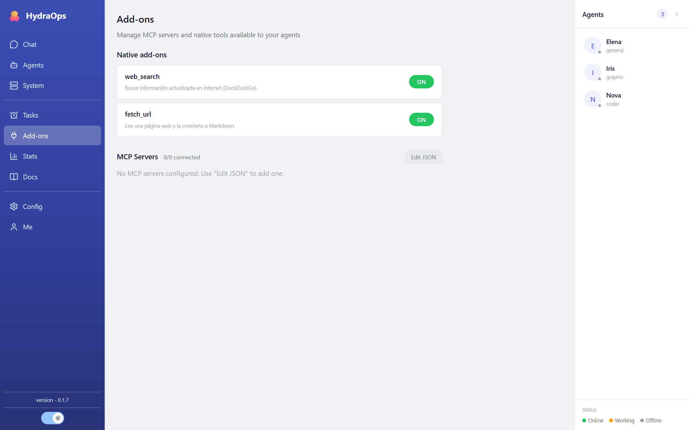

# Add-ons & MCP

Tools are what separate an agent that *answers* from one that *does*. HydraOps has three kinds, all managed from the **Add-ons** view.



## Native add-ons

They ship with the application. Today they are:

- `web_search` — search the web (DuckDuckGo, no key needed).
- `brave_search` — search with the Brave API; the key is pasted on its card and travels through the key-proxy.
- `perplexity_search` — ask Perplexity (Sonar): searches the web and returns a reasoned answer with cited sources; the key is pasted on its card and travels through the key-proxy.
- `fetch_url` — download and read a page.
- `youtube_transcript` — transcript of a YouTube video, no key needed.
- `remember` — the agent saves durable notes to its own memory (see [Agents](./05-agents.md)).
- `recall` — the agent searches its past conversations, beyond the recent history.
- `delegate_task` — the agent hands a task to another agent by name; the reply shows up in that agent's chat (see [Agents](./05-agents.md)).

Each card explains what its add-on does, and the integrations with external services (Telegram, GitHub) live in [Tools](./09-tools.md).

All of them go through a **security guard** that blocks credential paths, catastrophic commands and requests to internal networks, and redacts secrets from results. More in [Security](./13-security.md).

## Your add-ons (`my_addons/`)

You can write your own tools: each is a folder inside `my_addons/` (in the data folder) with a small module exporting the tool. They are **hot-loaded** — nothing to restart — and appear in the Add-ons view as "Custom".

Careful: your add-ons are your code and run unrestricted. Treat them as such.

Tell HydraOps what your tool does by adding a `risk` field to the exported object: `{ readsExternal: true }` if it returns text written by third parties (a page, a feed, an inbox), `{ sensitive: true }` if it acts or sends something out, or both. A tool that declares nothing is treated as both — the safe assumption. See [Security](./13-security.md).

## MCP servers

MCP (Model Context Protocol) is the standard for connecting third-party tools over HTTP. In **Add-ons → MCP servers**, the **Edit JSON** button opens the configuration:

```json
{
  "mcpServers": {
    "duckduckgo": {
      "url": "https://example.com/mcp",
      "headers": { "Authorization": "Bearer …" },
      "switch": "on"
    }
  }
}
```

Every server has its own switch, and the view shows its real status as reported by the workers: Connected, Connecting…, Connection error, Timed out, Off.

Servers start connecting **when the app starts**, not with the first task. Each worker connects only the servers its agents use: one that no agent has in its tools is not started. If one did not connect (docker still coming up, the application it drives was closed), it is **retried by itself** on the next task, at most once a minute; and if a server says it lost its connection (you closed and reopened Blender, say), HydraOps restarts it so it reconnects. No need to touch the configuration.

### Images a tool returns

Some tools answer with a picture: a viewport capture from Blender, a page screenshot from a browser server. If the agent's model can see images (OpenAI, Anthropic and Gemini chat models, and others whose name says so), the picture is shown to it right after the tool result, so it can actually check its work; the two most recent ones stay attached while the task goes on. A model that cannot see images is told plainly that it was not shown the picture, so it does not claim to have looked at it.

With a local model, set `LOCAL_LLM_VISION=1` in the `.env` if your server has the multimodal projector loaded. `HYDRA_TOOL_IMAGES=off` turns this off for every model, and `all` forces it on.

### What each tool does (`toolRisk`)

> For the most common servers you do not need to write this by hand: the catalog's [Connections](./09-tools.md) already carry the command and the classification of each tool.

A local server that drives an application of yours (through `command`) is configured here too. HydraOps cannot know what each tool of an unknown server does, so it treats it as the worst case: it **reads third-party content and acts**. With that, as soon as the agent uses two tools of that server in one task, the second is held for your approval (see [Security](./13-security.md)), even if it is only reading. `toolRisk` says what each one does:

```json
{
  "mcpServers": {
    "Blender": {
      "command": "uvx",
      "args": ["mcp-for-blender"],
      "toolRisk": {
        "get_scene_info": "neutral",
        "get_object_info": "neutral",
        "get_viewport_screenshot": "neutral",
        "execute_blender_code": "acts"
      }
    }
  }
}
```

- `neutral`: neither reads third-party content nor acts (your own application's state, the time).
- `read`: brings in third-party content (a page, search results); changes nothing. Marks the task.
- `acts`: changes something (runs code, writes, sends). Held if the task has already read third-party content.
- `both`: both.

The name is the tool's as the server publishes it, without the server prefix. Tools you do not list follow the usual rule: a known server, the server's own `readOnlyHint` annotation, or the worst case.

## Which tools each agent sees

None, until you grant them: a tool — native, custom add-on or MCP server — reaches an agent only if its `tools.md` names it. It's managed with the tag selector in the Agents view (see [Agents](./05-agents.md)); new agents come with `web_search`, `fetch_url`, `remember` and `recall` already granted. That way your research agent can have a web search tool while your coding agent doesn't.

On top of that, every native add-on has a global switch in this view: turning it off here turns it off for **every** agent, whatever its `tools.md` says.
