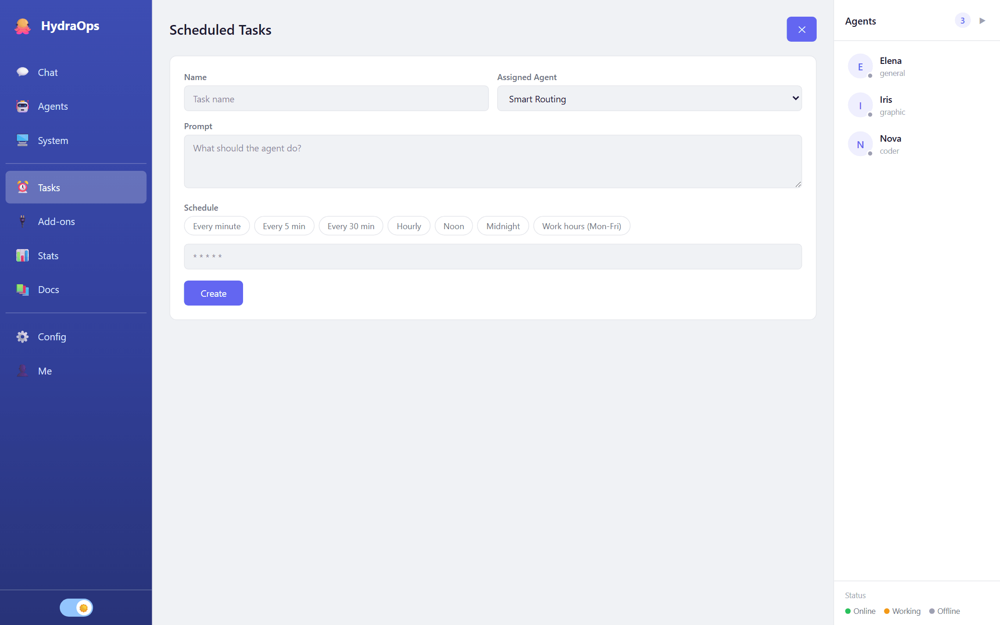

# Scheduled tasks

The **Tasks** view holds the crons: tasks that run by themselves, at the time you say, whose result arrives in the chat like any other. "Every morning at 8, summarize the news from these sites" is a scheduled task.



## Creating one

Click **New Task**:

- **Name** — to recognize it in the list.
- **Assigned Agent** — who runs it; or **Smart Routing**, and the system picks the agent based on the task.
- **Prompt** — what it should do, written the way you would ask in chat.
- **Schedule** — when. There are shortcuts (every minute, every 5, every 30, hourly, noon, midnight, work hours) or a raw cron expression:

```
┌ minute (0-59)
│ ┌ hour (0-23)
│ │ ┌ day of month (1-31)
│ │ │ ┌ month (1-12)
│ │ │ │ ┌ day of week (0-6, Sunday=0)
* * * * *
```

`0 8 * * *` = every day at 8:00. `*/15 9-18 * * 1-5` = every 15 minutes, 9 to 18, Monday to Friday.

## Managing them

Each task in the list shows its state (**active** / **paused**) and can be paused, edited or deleted. Deleting asks you to type the name to confirm — a cron deleted by accident gives no warning until you miss its result.

## Tips

- Start with a frequent schedule (every minute) to check the prompt does what you want, then switch it to the real one.
- The result arrives in the chat signed by the agent: many frequent tasks will fill the channel — and every run consumes tokens from your provider.
- Remember tasks only run while HydraOps is on. To have them run always, use [server mode](./12-server-mode.md) on a 24/7 machine.
