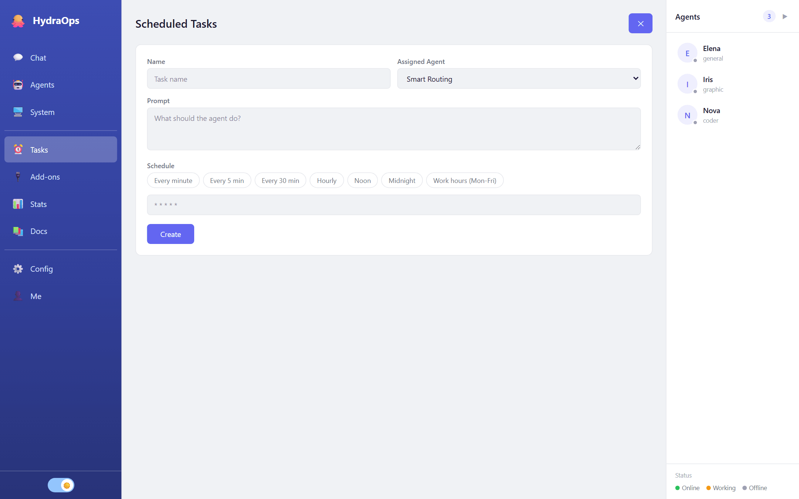

# Scheduled tasks

The **Tasks** view holds the crons: tasks that run by themselves, at the time you say, whose result arrives in the chat like any other. "Every morning at 8, summarize the news from these sites" is a scheduled task.



## Creating one

Click **New Task**:

- **Name** — to recognize it in the list.
- **Assigned Agent** — who runs it. A scheduled task always runs on a specific agent.
- **Prompt** — what it should do, written the way you would ask in chat.
- **Schedule** — when. Pick the frequency and the rest builds itself: **every N minutes**, **every hour** (at a given minute), **every day** at a time, **days of the week** (with the days ticked) at a time, **once a month** on a given day, or **cron expression** for anything those cannot express. The shortcuts (every 5 min, noon, work hours…) are still there, and the resulting expression shows underneath. An existing task opens already translated into these choices.

They can also be created from the chat with `/cron <schedule> <prompt>` (see [Commands](./15-commands.md)): it opens this form pre-filled for you to confirm.

The cron expression, for the manual mode:

```
┌ minute (0-59)
│ ┌ hour (0-23)
│ │ ┌ day of month (1-31)
│ │ │ ┌ month (1-12)
│ │ │ │ ┌ day of week (0-6, Sunday=0)
* * * * *
```

`0 8 * * *` = every day at 8:00. `*/15 9-18 * * 1-5` = every 15 minutes, 9 to 18, Monday to Friday.

## Managing them

Each task in the list shows its state (**active** / **paused**) and can be paused, edited or deleted. Deleting asks you to type the name to confirm — a cron deleted by accident gives no warning until you miss its result.

## Only what is new

A task like "bring me the latest news from this feed" would deliver the same items every time. HydraOps keeps a record, per task, of what its earlier runs did: the **links they delivered** and **what each page they read said**. The agent gets the delivered links before it starts, and its answer is then filtered by the app itself, not by asking the model again, before it reaches you (or your Telegram):

- If the pages the task reads say exactly what they said in an earlier run, you get one line: nothing new.
- Otherwise the items whose links were already delivered are removed and only the rest goes out. If nothing is left, you get the one line.
- A page that was read again and now says something else (a price, a status) is not a repeat: that item is kept.

The record is made of links, so ask for sources in the task ("with the link of each item"). An item that comes with its link is never repeated; an item without one, from a page that did change, cannot be told apart from a new one and goes out as the agent wrote it. Each scheduled task keeps its own record, runs that found nothing do not erase it, and a failed run does not count as delivered.

## Tips

- Start with a frequent schedule (every minute) to check the prompt does what you want, then switch it to the real one.
- The result arrives in the chat signed by the agent: many frequent tasks will fill the channel — and every run consumes tokens from your provider.
- Remember tasks only run while HydraOps is on. To have them run always, use [server mode](./12-server-mode.md) on a 24/7 machine.
- If the task names its sources (a feed, a page), the agent has to open at least one of them in every run. An answer written without opening any is sent back once; if the second one does not open them either, the run shows a notice instead of an answer that could be made up.
