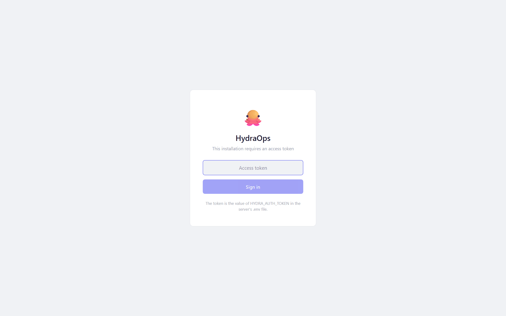

# Server mode

Server mode means keeping HydraOps on 24/7 on a machine with no screen — a mini PC at home, an old laptop — and using it from the browser of any device on your network. It is also what makes [scheduled tasks](./10-scheduled-tasks.md) run at all times.

## Starting the stack

With the project [installed from source](./02-installation.md):

```bash
pnpm serve
```

One command brings up NATS and all eight services, no window. It applies migrations and seeds the database by itself, waits for each phase to be healthy, restarts anything that crashes, and Ctrl+C stops the whole stack. Logs go to the console prefixed per service.

With that, the application is at `http://127.0.0.1:3000` — but only from that machine.

## Opening it to your local network

Two lines in the `.env`:

```bash
HYDRA_HOST=0.0.0.0
HYDRA_AUTH_TOKEN=a-long-hard-to-guess-token
```

To generate a decent token:

```bash
node -e "console.log(crypto.randomBytes(24).toString('base64url'))"
```

Restart `pnpm serve` and its output will print the network URLs (`http://192.168.x.x:3000`). From another device, the browser asks for the token once (login screen) and keeps a 30-day session; "Log out" is in the Profile view.



**Without a token defined, the API refuses to open to the network** and stays on `127.0.0.1`. Connections from the server's own machine never need the token.

The token travels in the clear over HTTP: fine for your local network, **not** for opening the port to the internet. If you want access from outside your home, put it behind HTTPS (a reverse proxy with a certificate) or a VPN (WireGuard, Tailscale) — and with a reverse proxy in front, add `HYDRA_AUTH_STRICT=1` to the `.env`.

## Starting on boot (Linux, systemd)

The repository ships a ready unit: [`deploy/hydraops.service`](../../deploy/hydraops.service), with installation instructions in its comments. In short:

```bash
sudo cp deploy/hydraops.service /etc/systemd/system/
# edit User=, WorkingDirectory=, ExecStart= and ReadWritePaths= to your user and path
sudo systemctl daemon-reload
sudo systemctl enable --now hydraops
```

Every service's logs end up in the journal: `journalctl -u hydraops -f`. Stopping with `systemctl stop hydraops` shuts the whole stack down cleanly.

## Updating a server

```bash
git pull
pnpm install
pnpm build && pnpm --filter ui build
sudo systemctl restart hydraops   # or Ctrl+C and pnpm serve again
```
