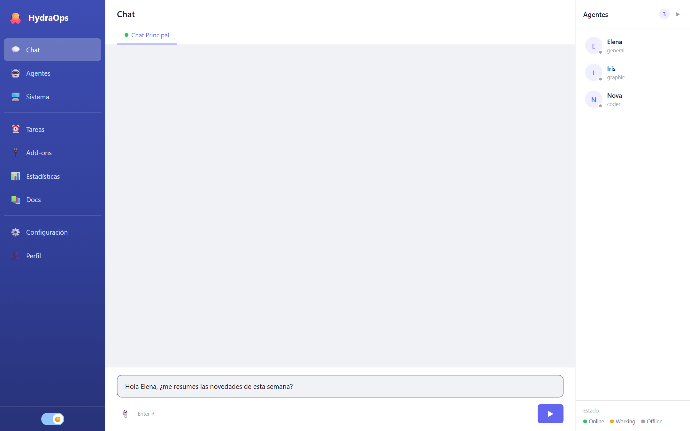

# Primeros pasos

La primera vez que abras HydraOps, dos cosas antes de nada: un modelo con el que trabajar y al menos un agente. Sin agentes, los mensajes se quedan sin asignar.

## 1. Configura un modelo

Ve a **Configuración** (icono de engranaje en la barra lateral) y pega la clave de API de tu proveedor — con una basta para empezar. Si prefieres un modelo local (llama.cpp, LM Studio, Ollama…), se configura en el `.env`. Los detalles, en [Claves de API y modelos](./04-api-keys.md).

## 2. Crea tu primer agente

En la vista **Agentes**, pulsa **Nuevo agente**: nombre, tipo de worker (para empezar, **general**) y modelo. Se crea con seis archivos de personalidad de plantilla que puedes editar cuando quieras. Más en [Agentes](./05-agents.md).

## 3. Habla con él

Ve a **Chat** y escribe. La tarea se asigna al agente y la respuesta aparece en el canal. Puedes adjuntar imágenes y documentos con el clip 📎. Más en [El chat](./06-chat.md).

## Un recorrido por la barra lateral

- **Chat** — el canal principal donde hablas con los agentes y llegan los resultados.
- **Agentes** — crear, configurar y editar agentes; su avatar, su modelo y sus archivos.
- **Sistema** — el estado de los workers y sus logs.
- **Tareas** — las tareas programadas (crons).
- **Add-ons** — las herramientas: add-ons nativos, los tuyos y servidores MCP.
- **Estadísticas** — tareas completadas y fallidas, tokens, tiempos, uso por agente.
- **Docs** — este manual.
- **Configuración** — claves de API, modelo por defecto, LLM local, nivel de log.
- **Perfil** — quién eres tú: los agentes usan esa información para personalizar sus respuestas.

El botón de la luna/sol cambia entre tema día y noche, y el idioma de la interfaz se elige en **Configuración → Lenguajes** (el manual existe en español e inglés; con la interfaz en otro idioma, se muestra en inglés).

## El panel derecho

La lista de agentes está siempre a mano en el panel derecho. Cada uno muestra su estado; con el botón 💬 abres el chat con él, y con doble clic en su avatar dentro del chat saltas a su ficha.
