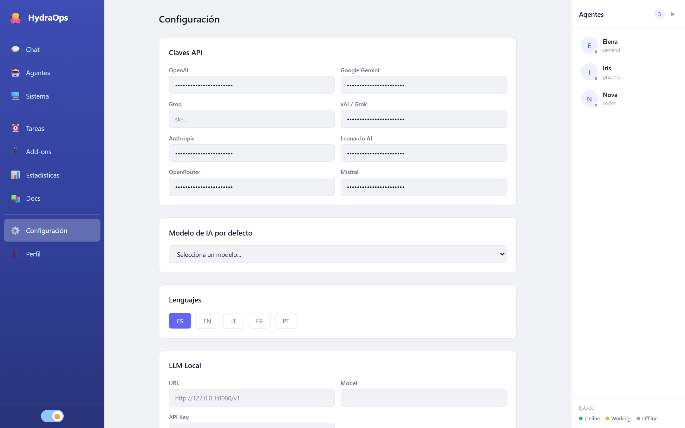

# Claves de API y modelos

## Poner una clave de API

En **Configuración → Claves API** hay un campo por proveedor: OpenAI, Anthropic, Gemini, Groq, xAI, Mistral, OpenRouter y Leonardo. Pega la clave y guarda. No hace falta rellenarlos todos: con un proveedor ya funcionan los agentes que usen sus modelos.



Las claves **no se guardan en el proyecto, ni en la base de datos, ni en ningún `.env`**: van a un almacén propio fuera de la aplicación (`%APPDATA%\hydraops\keys.json` en Windows) y un proceso local —el key-proxy— las inyecta solo en el momento de llamar al proveedor. Por eso la vista Configuración te las enseña enmascaradas: es lo esperado. Más en [Seguridad](./11-security.md).

## Elegir modelo

- **Modelo por defecto:** en Configuración; se usa cuando un agente no tiene uno propio.
- **Modelo por agente:** en la ficha del agente (vista Agentes). Cada agente puede usar un proveedor distinto.

Los modelos de proveedores sin clave aparecen como "no disponible" hasta que pongas la suya.

## Modelo local

Si tienes un servidor local compatible con OpenAI (llama.cpp, LM Studio, vLLM, Ollama…), se configura con tres variables en el archivo `.env` del proyecto (o del servidor, en modo headless):

```bash
LOCAL_LLM_URL=http://127.0.0.1:8080/v1   # la URL de tu servidor
LOCAL_LLM_KEY=                           # si tu servidor pide clave; si no, vacío
LOCAL_LLM_MODEL=mi-modelo                # el nombre que tu servidor anuncia
```

Viven en el `.env` a propósito y los workers lo releen **en cada tarea**: puedes cambiar de servidor o de modelo local sin reiniciar nada. En la lista de modelos, el local aparece con la etiqueta "Local:".

Si tu servidor local soporta visión (un modelo multimodal con su proyector), los agentes también podrán ver las imágenes que adjuntes en el chat.

## ¿Qué proveedor uso?

El que ya tengas. Como referencia: Gemini y Groq tienen niveles gratuitos generosos para empezar; OpenRouter da acceso a muchos modelos con una sola clave; Leonardo es específico de generación de imagen; y un modelo local no cuesta nada por tarea, a cambio de tu hardware.
