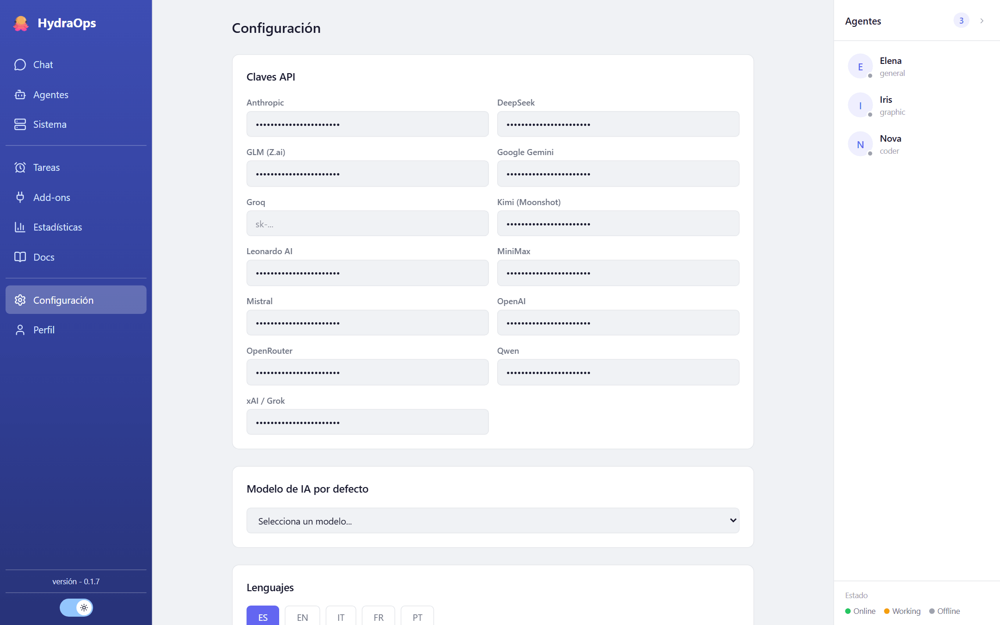

# Claves de API y modelos

## Poner una clave de API

En **Configuración → Claves API** hay un campo por proveedor: OpenAI, Anthropic, Gemini, Groq, xAI, Mistral, DeepSeek, Qwen, Kimi, GLM, MiniMax, OpenRouter y Leonardo. Pega la clave y guarda. No hace falta rellenarlos todos: con un proveedor ya funcionan los agentes que usen sus modelos.



Las claves **no se guardan en el proyecto, ni en la base de datos, ni en ningún `.env`**: van a un almacén propio fuera de la aplicación (`%APPDATA%\hydraops\keys.json` en Windows) y un proceso local —el key-proxy— las inyecta solo en el momento de llamar al proveedor. Por eso la vista Configuración te las enseña enmascaradas: es lo esperado. Más en [Seguridad](./13-security.md).

## Usar la suscripción de ChatGPT

Si tenés ChatGPT Plus o Pro, podés usar ese plan en vez de una clave de OpenAI. OpenAI ofrece a las aplicaciones de código abierto un inicio de sesión ("Sign in with ChatGPT", en vista previa) por el que el usuario autoriza que las consultas a los modelos se descuenten de su plan, con un tope semanal por aplicación que fija él mismo.

En **Configuración → ChatGPT (suscripción)** tocá **Conectar con ChatGPT**: se abre el navegador de ese mismo equipo, iniciás sesión en OpenAI y aceptás el permiso. Al volver, la sección muestra la cuenta (con el correo enmascarado) y los modelos que tu plan habilita; en el selector de modelos aparecen agrupados como **ChatGPT (plan)**, separados de los de **APIkey · OpenAI** si además tenés una clave cargada. Cada agente elige uno u otro.

Lo que conviene saber:

- HydraOps no ve tu contraseña ni tus conversaciones de ChatGPT: solo recibe un permiso para consultar modelos. Los tokens de acceso quedan en el equipo, junto a las claves (`%APPDATA%\hydraops\chatgpt.json`), y los maneja el key-proxy; nunca van a la base de datos ni al chat.
- El permiso se renueva solo mientras HydraOps se use al menos una vez al mes. Si vence, la sección lo dice y alcanza con volver a conectar.
- El tope semanal lo fijás en ChatGPT → Ajustes → Uso. No hay cargos por token; si se llega al tope, la tarea del agente falla con un aviso claro y podés subir el tope o cambiar el modelo del agente con `/model`.
- Sirve para chat, agentes con sus herramientas, tareas programadas y Telegram. No sirve para generar imágenes, video ni audio: eso sigue necesitando la clave del proveedor.
- En modo servidor el enlace de inicio de sesión tiene que abrirse en un navegador **del mismo equipo** (por ejemplo por escritorio remoto); la sección lo muestra para copiarlo y también sale en la consola. Desde el teléfono no funciona, porque la vuelta es a una dirección local de esa máquina.
- Solo OpenAI permite esto. Anthropic y Google prohíben usar sus suscripciones desde aplicaciones de terceros, así que Claude y Gemini siguen por clave.

Para desconectar, **Desconectar** en la misma sección: se revoca el permiso en OpenAI y se borran los tokens. También podés quitar la aplicación desde los ajustes de ChatGPT.

## Elegir modelo

- **Modelo predeterminado:** en Configuración; se usa cuando un agente no tiene uno propio.
- **Modelo por agente:** en la ficha del agente (vista Agentes). Cada agente puede usar un proveedor distinto.

Los modelos de proveedores sin clave aparecen como "no disponible" hasta que pongas la suya.

## Modelo local

Si tienes un servidor local compatible con OpenAI (llama.cpp, LM Studio, vLLM, Ollama…), se configura con tres variables en el archivo `.env` del proyecto (o del servidor, en modo headless):

```bash
LOCAL_LLM_URL=http://127.0.0.1:8080/v1   # la URL de tu servidor
LOCAL_LLM_KEY=                           # si tu servidor pide clave; si no, vacío
LOCAL_LLM_MODEL=mi-modelo                # el nombre que tu servidor anuncia
```

Viven en el `.env` a propósito y los workers lo releen **en cada tarea**: puedes cambiar de servidor o de modelo local sin reiniciar nada. En la lista de modelos, el local aparece con la etiqueta "Local:".

Si tu servidor local soporta visión (un modelo multimodal con su proyector), los agentes también podrán ver las imágenes que adjuntes en el chat.

## ¿Qué proveedor uso?

El que ya tengas. Como referencia: Gemini y Groq tienen niveles gratuitos generosos para empezar; OpenRouter da acceso a muchos modelos con una sola clave; Leonardo es específico de generación de imagen; y un modelo local no cuesta nada por tarea, a cambio de tu hardware.
