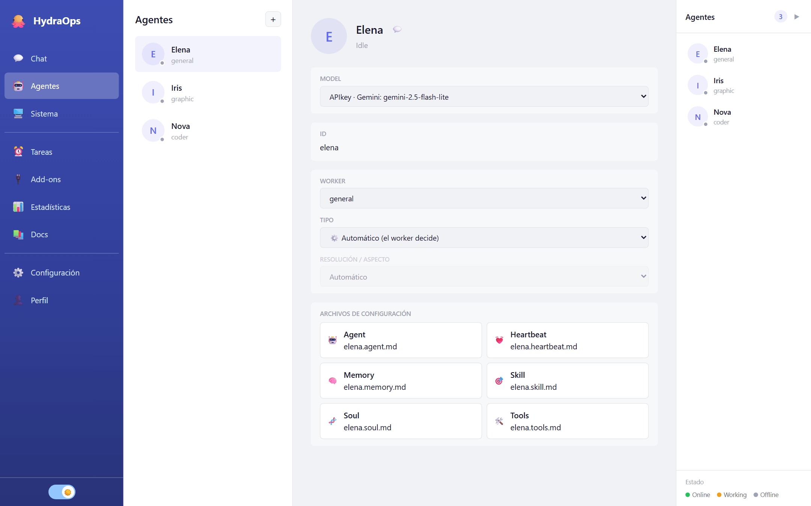

# Agentes

Un agente es quien hace el trabajo: tiene nombre, avatar, personalidad, un tipo de worker, un modelo y sus herramientas. Puedes tener los que quieras, cada uno especializado en algo.

## Crear un agente

En la vista **Agentes**, pulsa **Nuevo agente** y elige:

- **Nombre** — de él sale su identificador (por ejemplo "Ana María" → `ana_maria`).
- **Tipo de worker** — qué clase de tareas resuelve:
  - **general** — preguntas, investigación, redacción; el todoterreno.
  - **coder** — tareas de código.
  - **graphic** — generación de imágenes.
  - **video** — generación de vídeo.
- **Modelo** — el LLM que usará; si no eliges, el modelo por defecto de Configuración.

## La ficha del agente

Al seleccionar un agente en la lista se abre su ficha:

- **Avatar** — clic para cambiarlo (PNG/JPG/WebP, máximo 2 MB).
- **Renombrar** — el lápiz junto al nombre.
- **Modelo y motor** — el LLM del agente; en los workers de imagen y vídeo, además el motor de generación y la **resolución/aspecto** (o "Automático": el worker decide).
- **Archivos de configuración** — los seis Markdown de su personalidad, editables en un modal.
- **💬** — abre el chat con él.

## Los seis archivos

Cada agente es una carpeta `agents/<id>/` con seis archivos Markdown. Son texto libre: escríbelos como le hablarías a la persona que contratas.

| Archivo | Qué va dentro |
|---|---|
| `<id>.soul.md` | Quién es: personalidad, tono, forma de responder. |
| `<id>.skill.md` | Qué sabe hacer: sus especialidades y cómo debe abordarlas. |
| `<id>.agent.md` | Su ficha: rol, descripción, emoji. |
| `<id>.tools.md` | Qué herramientas puede usar y cuáles no (ver [Add-ons y MCP](./07-addons.md)). |
| `<id>.memory.md` | Memoria persistente: lo que debe recordar entre conversaciones. |
| `<id>.heartbeat.md` | Su latido: instrucciones que se aplican en cada ciclo. |

Los cambios se aplican en las tareas siguientes, sin reiniciar nada.

**Herramientas por agente (`<id>.tools.md`).** Un agente solo puede usar una herramienta —nativa, add-on o servidor MCP— si su `tools.md` la **nombra**, en una línea con viñeta. Si no lista ninguna, el agente no tiene herramientas. Puedes poner el nombre exacto (`- web_search`) o un grupo por prefijo (`- github` habilita todas las `github_*`; el nombre de un servidor MCP habilita sus herramientas). El resto del archivo es texto libre para el agente; solo las viñetas con nombres de herramienta conceden acceso. Esto vale para cualquier tipo de worker.

Además de estos archivos, **cada tipo de worker aporta su oficio de serie**: el de imagen sabe de teoría del color y composición, el de vídeo de encuadre y cinematografía, el de código de arquitectura y patrones, y el general del trato con las personas. Ese saber viene con la aplicación y lo heredan todos los agentes del tipo — tus seis archivos definen *quién es* tu agente y su especialización concreta; el worker pone la profesión.

## Borrar un agente

Desde su ficha. Se borra su carpeta y su configuración; sus mensajes ya enviados se quedan en el historial del chat.
