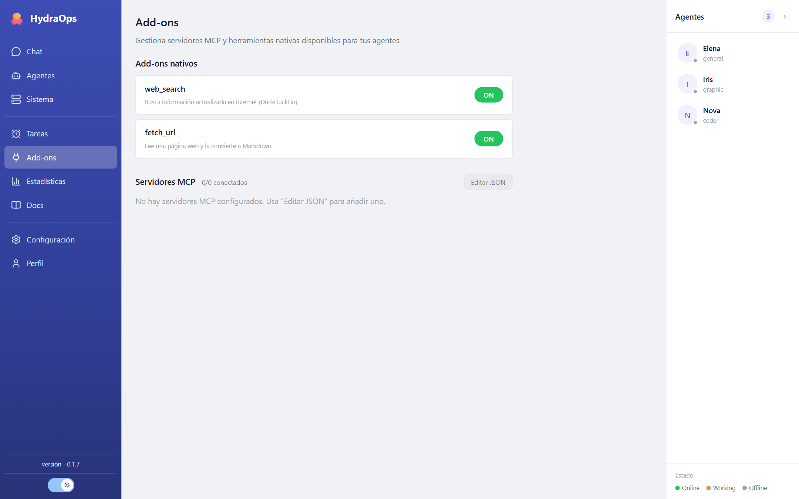

# Add-ons y MCP

Las herramientas son lo que separa a un agente que *contesta* de uno que *hace*. En HydraOps hay tres clases, y las tres se gestionan desde la vista **Add-ons**.



## Add-ons nativos

Vienen con la aplicación: hoy son `web_search` (buscar en la web) y `fetch_url` (descargar una página). Cada tarjeta explica qué hace el suyo.

Todos pasan por un **guard de seguridad** que bloquea rutas de credenciales, comandos catastróficos y peticiones a redes internas, y redacta secretos de los resultados. Más en [Seguridad](./13-security.md).

## Tus add-ons (`my_addons/`)

Puedes escribir herramientas propias: cada una es una carpeta dentro de `my_addons/` (en la carpeta de datos) con un pequeño módulo que exporta la herramienta. Se cargan **en caliente** — no hay que reiniciar nada — y aparecen en la vista Add-ons como "Personalizado".

Ojo: tus add-ons son código tuyo y se ejecutan sin restricción. Trátalos como tal.

## Servidores MCP

MCP (Model Context Protocol) es el estándar para conectar herramientas de terceros por HTTP. En **Add-ons → Servidores MCP**, el botón **Editar JSON** abre la configuración:

```json
{
  "mcpServers": {
    "duckduckgo": {
      "url": "https://ejemplo.com/mcp",
      "headers": { "Authorization": "Bearer …" },
      "switch": "on"
    }
  }
}
```

Cada servidor tiene su interruptor, y la vista muestra su estado real según lo reportan los workers: Conectado, Conectando…, Error de conexión, Tiempo agotado, Apagado.

## Qué herramientas ve cada agente

Por defecto, un agente ve las herramientas de su tipo de worker. Para afinarlo, edita el archivo `tools.md` del agente (vista Agentes → Archivos de configuración): ahí se declara qué add-ons y qué servidores MCP puede usar ese agente en concreto. Así tu agente de investigación puede tener buscador y tu agente de código no.
