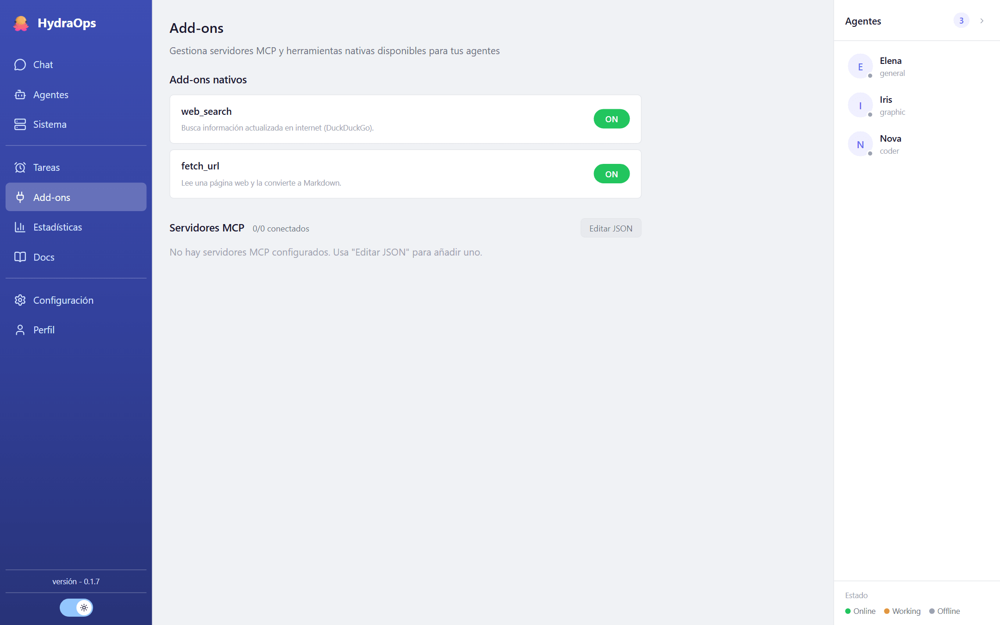

# Add-ons y MCP

Las herramientas son lo que separa a un agente que *contesta* de uno que *hace*. En HydraOps hay tres clases, y las tres se gestionan desde la vista **Add-ons**.



## Add-ons nativos

Vienen con la aplicación. Hoy son:

- `web_search` — buscar en la web (DuckDuckGo, sin clave). DuckDuckGo a veces rechaza las búsquedas automáticas durante unos minutos; al agente se le dice entonces que la búsqueda fue **bloqueada**, no que no hubo resultados, para que lo avise en lugar de contestar de memoria. Si pasa seguido, dale también `brave_search`.
- `brave_search` — búsqueda con la API de Brave; la clave se pega en su tarjeta y viaja por el key-proxy.
- `perplexity_search` — pregunta a Perplexity (Sonar): busca en la web y devuelve una respuesta razonada con sus fuentes citadas; la clave se pega en su tarjeta y viaja por el key-proxy.
- `fetch_url` — descargar y leer una página.
- `comfy_workflows` — los flujos que guardaste en tu ComfyUI: los lista, prepara uno para correr (una copia, con los archivos que adjuntaste ya subidos y puestos en sus entradas) y trae lo que guardó un trabajo terminado. Trabaja junto con la conexión de ComfyUI, que es la que corre el flujo, y llega a ComfyUI por la dirección configurada en esa conexión (ver [Herramientas](./09-tools.md)).
- `youtube_transcript` — transcripción de un vídeo de YouTube, sin clave.
- `remember` — el agente guarda notas duraderas en su propia memoria (ver [Agentes](./05-agents.md)).
- `recall` — el agente busca en sus conversaciones pasadas, más allá del historial reciente.
- `delegate_task` — el agente le pasa una tarea a otro agente por su nombre; la respuesta aparece en el chat del otro (ver [Agentes](./05-agents.md)).

Cada tarjeta explica qué hace el suyo, y las integraciones con servicios externos (Telegram, GitHub) viven en [Herramientas](./09-tools.md).

Todos pasan por un **guard de seguridad** que bloquea rutas de credenciales, comandos catastróficos y peticiones a redes internas, y redacta secretos de los resultados. Más en [Seguridad](./13-security.md).

## Tus add-ons (`my_addons/`)

Puedes escribir herramientas propias: cada una es una carpeta dentro de `my_addons/` (en la carpeta de datos) con un pequeño módulo que exporta la herramienta. Se cargan **en caliente** — no hay que reiniciar nada — y aparecen en la vista Add-ons como "Personalizado".

Ojo: tus add-ons son código tuyo y se ejecutan sin restricción. Trátalos como tal.

Decile a HydraOps qué hace tu herramienta agregando un campo `risk` al objeto exportado: `{ readsExternal: true }` si devuelve texto escrito por terceros (una página, un feed, una bandeja de entrada), `{ sensitive: true }` si actúa o manda algo hacia afuera, o ambos. Una herramienta que no declara nada se trata como las dos cosas — la suposición segura. Ver [Seguridad](./13-security.md).

## Servidores MCP

MCP (Model Context Protocol) es el estándar para conectar herramientas de terceros por HTTP. En **Add-ons → Servidores MCP**, el botón **Editar JSON** abre la configuración:

```json
{
  "mcpServers": {
    "duckduckgo": {
      "url": "https://ejemplo.com/mcp",
      "headers": { "Authorization": "Bearer …" },
      "switch": "on"
    }
  }
}
```

Cada servidor tiene su interruptor, y la vista muestra su estado real según lo reportan los workers: Conectado, Conectando…, Error de conexión, Tiempo agotado, Apagado.

Los servidores empiezan a conectarse **cuando arranca la app**, no con la primera tarea. Cada worker conecta solo los servidores que usan sus agentes: uno que ningún agente tiene en sus herramientas no se arranca. Si uno no conectó (docker todavía levantando, la aplicación que maneja estaba cerrada), se **reintenta solo** en la tarea siguiente, como mucho una vez por minuto; y si un servidor avisa que perdió su conexión (cerraste y reabriste Blender, por ejemplo), HydraOps lo reinicia para que se reconecte. No hace falta tocar la configuración.

### Imágenes que devuelve una herramienta

Algunas herramientas responden con una imagen: una captura del visor de Blender, una captura de página de un servidor de navegador. Si el modelo del agente ve imágenes (los modelos de chat de OpenAI, Anthropic y Gemini, y otros cuyo nombre lo indica), la imagen se le muestra justo después del resultado de la herramienta, así puede comprobar de verdad su trabajo; las dos más recientes siguen adjuntas mientras dura la tarea. A un modelo que no ve imágenes se le dice claramente que no se le mostró, para que no afirme haberla mirado.

Con un modelo local, pon `LOCAL_LLM_VISION=1` en el `.env` si tu servidor tiene cargado el proyector multimodal. `HYDRA_TOOL_IMAGES=off` lo desactiva para todos los modelos y `all` lo fuerza.

### Qué hace cada herramienta (`toolRisk`)

> Para los servidores más comunes no hace falta escribir esto a mano: las [Conexiones](./09-tools.md) del catálogo ya traen el comando y la clasificación de cada herramienta.

Un servidor local que maneja una aplicación tuya (por `command`) también se configura acá. HydraOps no sabe qué hace cada herramienta de un servidor que no conoce, así que la trata como el peor caso: que **lee contenido de terceros y actúa**. Con eso, apenas el agente usa dos herramientas de ese servidor en una tarea, la segunda queda retenida para tu aprobación (ver [Seguridad](./13-security.md)), aunque solo esté leyendo. `toolRisk` le dice qué hace cada una:

```json
{
  "mcpServers": {
    "Blender": {
      "command": "uvx",
      "args": ["mcp-for-blender"],
      "toolRisk": {
        "get_scene_info": "neutral",
        "get_object_info": "neutral",
        "get_viewport_screenshot": "neutral",
        "execute_blender_code": "acts"
      }
    }
  }
}
```

- `neutral`: ni lee contenido de terceros ni actúa (el estado de tu propia aplicación, la hora).
- `read`: trae contenido de terceros (una página, resultados de búsqueda); no cambia nada. Marca la tarea.
- `acts`: cambia algo (ejecuta código, escribe, envía). Se retiene si la tarea ya leyó contenido de terceros.
- `both`: las dos cosas.

El nombre es el de la herramienta tal como la publica el servidor, sin el prefijo del servidor. Las que no listes siguen la regla de siempre: servidor conocido, anotación `readOnlyHint` del propio servidor, o el peor caso.

### Herramientas que tardan (`toolTimeoutSeconds`)

Una llamada a una herramienta de un servidor MCP tiene 30 segundos para responder. Alcanza para casi todas; un servidor cuyas herramientas esperan un trabajo largo (un render, la generación de una imagen o de un modelo 3D) necesita más, o cada llamada de esas se corta mientras el trabajo sigue. Poné `toolTimeoutSeconds` en la entrada de ese servidor, entre 30 y 3600:

```json
{
  "mcpServers": {
    "MiRender": {
      "command": "uvx",
      "args": ["my-render-server"],
      "toolTimeoutSeconds": 900
    }
  }
}
```

Vale para todas las herramientas de ese servidor y para ningún otro. Una conexión del catálogo que lo necesita ya trae su valor.

## Qué herramientas ve cada agente

Ninguna, hasta que se la concedas: una herramienta —nativa, add-on propio o servidor MCP— solo llega a un agente si su `tools.md` la nombra. Se gestiona con el selector de etiquetas de la vista Agentes (ver [Agentes](./05-agents.md)); los agentes nuevos vienen con `web_search`, `fetch_url`, `remember` y `recall` ya concedidas. Así tu agente de investigación puede tener buscador y tu agente de código no.

Además, cada add-on nativo tiene un interruptor global en esta vista: apagarlo aquí lo apaga para **todos** los agentes, diga lo que diga su `tools.md`.
