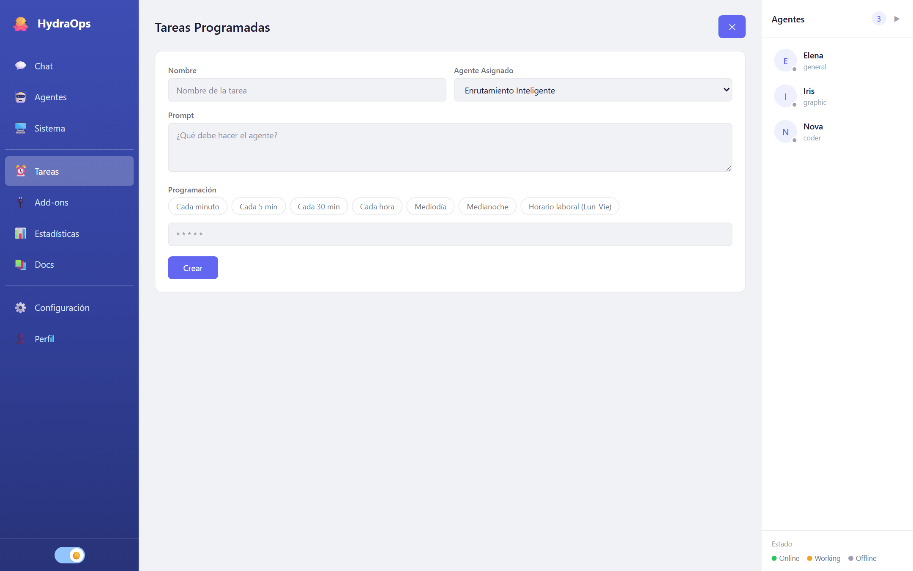

# Tareas programadas

La vista **Tareas** son los crons: tareas que se ejecutan solas, a la hora que digas, y cuyo resultado llega al chat como cualquier otro. "Cada mañana a las 8, resume las novedades de estos sitios" es una tarea programada.



## Crear una

Pulsa **Nueva Tarea**:

- **Nombre** — para reconocerla en la lista.
- **Agente Asignado** — quién la ejecuta; o **Enrutamiento Inteligente**, y el sistema elige el agente según la tarea.
- **Prompt** — qué debe hacer, escrito como se lo pedirías por chat.
- **Programación** — cuándo. Hay atajos (cada minuto, cada 5, cada 30, cada hora, mediodía, medianoche, horario laboral) o expresión cron directa:

```
┌ minuto (0-59)
│ ┌ hora (0-23)
│ │ ┌ día del mes (1-31)
│ │ │ ┌ mes (1-12)
│ │ │ │ ┌ día de la semana (0-6, domingo=0)
* * * * *
```

`0 8 * * *` = todos los días a las 8:00. `*/15 9-18 * * 1-5` = cada 15 minutos, de 9 a 18, de lunes a viernes.

## Gestionarlas

Cada tarea de la lista muestra su estado (**activa** / **pausada**) y se puede pausar, editar o borrar. El borrado pide confirmación escribiendo el nombre — un cron borrado por accidente no avisa hasta que echas de menos su resultado.

## Consejos

- Empieza con una programación frecuente (cada minuto) para probar que el prompt hace lo que quieres, y cámbiala después a la definitiva.
- El resultado llega al chat firmado por el agente: si programas muchas tareas frecuentes, el canal se llena — y cada ejecución consume tokens de tu proveedor.
- Recuerda que las tareas corren solo mientras HydraOps está encendido. Para que corran siempre, el [modo servidor](./11-server-mode.md) en una máquina 24/7.
