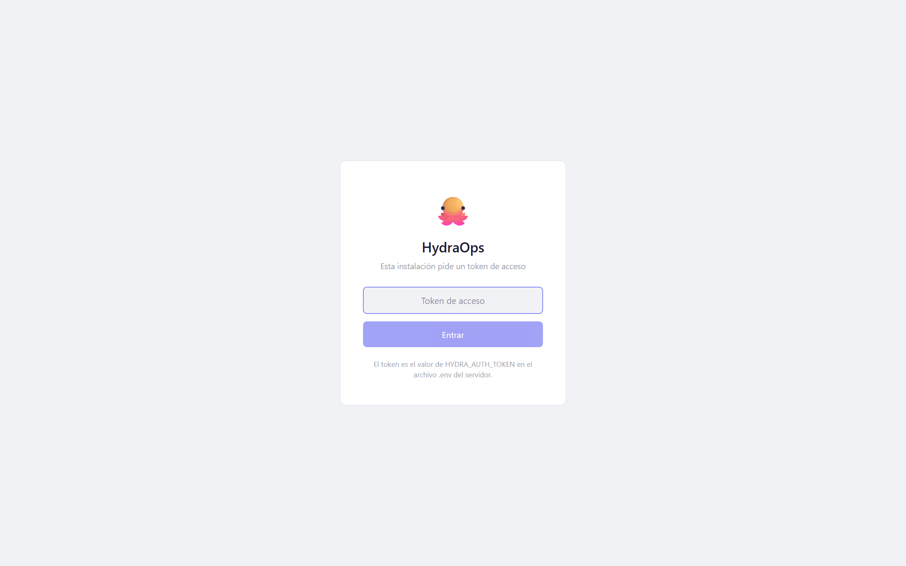

# Modo servidor

El modo servidor es tener HydraOps encendido 24/7 en una máquina sin pantalla —un mini PC en casa, un viejo portátil— y usarlo desde el navegador de cualquier equipo de tu red. También es lo que hace que las [tareas programadas](./10-scheduled-tasks.md) corran siempre.

## Arrancar la pila

Con el proyecto [instalado desde el código](./02-installation.md):

```bash
pnpm serve
```

Un solo comando levanta NATS y los ocho servicios, sin ventana. Aplica las migraciones y siembra la base de datos él solo, espera la salud de cada fase, reinicia lo que se caiga, y con Ctrl+C para la pila entera. Los logs salen por consola con prefijo por servicio.

Con eso ya tienes la aplicación en `http://127.0.0.1:3000` — pero solo desde esa máquina.

## Abrirlo a tu red local

Dos líneas en el `.env`:

```bash
HYDRA_HOST=0.0.0.0
HYDRA_AUTH_TOKEN=un-token-largo-y-dificil
```

Para generar un token decente:

```bash
node -e "console.log(crypto.randomBytes(24).toString('base64url'))"
```

Reinicia `pnpm serve` y su salida imprimirá las URLs de red (`http://192.168.x.x:3000`). Desde otro equipo, el navegador te pedirá el token una vez (pantalla de login) y quedará una sesión de 30 días; "Cerrar sesión" está en la vista Perfil.



**Sin token definido, la API se niega a abrirse a la red** y se queda en `127.0.0.1`. Las conexiones desde la propia máquina del servidor nunca necesitan token.

El token viaja en claro por HTTP: vale para tu red local, **no** para abrir el puerto a internet. Si quieres acceso desde fuera de casa, ponlo detrás de HTTPS (proxy inverso con certificado) o de una VPN (WireGuard, Tailscale) — y con proxy inverso delante, añade `HYDRA_AUTH_STRICT=1` al `.env`.

## Arrancar solo al encender (Linux, systemd)

En el repositorio hay una unidad lista: [`deploy/hydraops.service`](../../deploy/hydraops.service), con las instrucciones de instalación en sus comentarios. En resumen:

```bash
sudo cp deploy/hydraops.service /etc/systemd/system/
# edita User=, WorkingDirectory=, ExecStart= y ReadWritePaths= a tu usuario y tu ruta
sudo systemctl daemon-reload
sudo systemctl enable --now hydraops
```

Los logs de todos los servicios acaban en el journal: `journalctl -u hydraops -f`. Parar con `systemctl stop hydraops` hace un apagado limpio de la pila entera.

## Actualizar un servidor

```bash
git pull
pnpm install
pnpm build && pnpm --filter ui build
sudo systemctl restart hydraops   # o Ctrl+C y pnpm serve de nuevo
```
